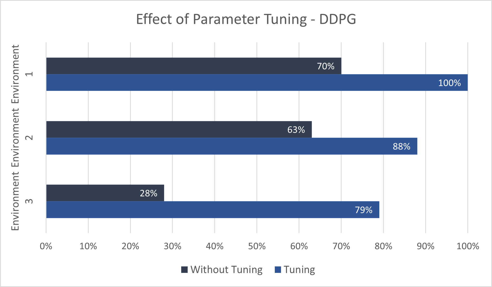
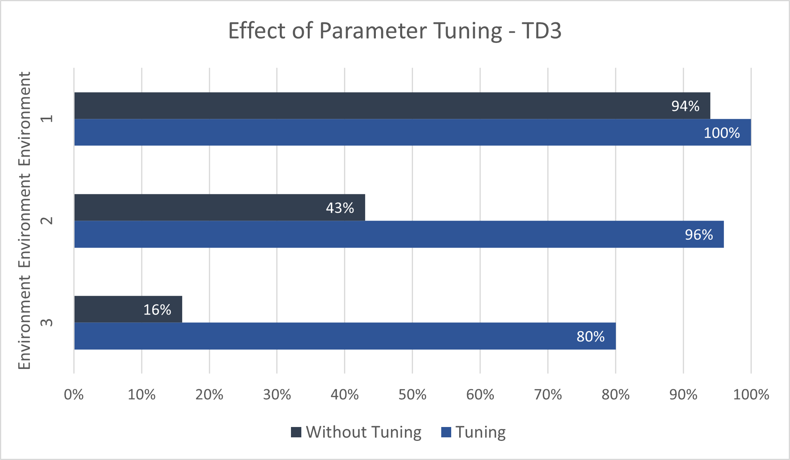
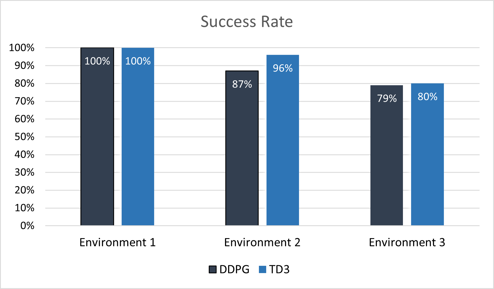
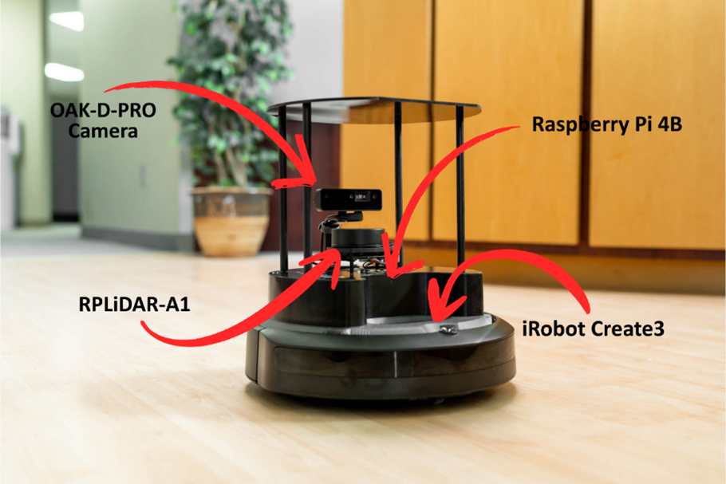

# Deep Reinforcement Learning for Autonomous Navigation

## 🚀 Overview
The goal is to train DRL agents (**DDPG** and **TD3**) in a simulated environment (Gazebo) and successfully deploy them on a physical **TurtleBot4** robot. A significant part of the work involved bridging the **Sim-to-Real gap** and optimizing the agents' performance in complex unknown environments through extensive **hyperparameter tuning**.

## 🛠 Key Contributions
### 1. Hyperparameter Optimization
Achieved significant performance improvements by fine-tuning the learning process. 
- Conducted multiple training sessions to find the optimal balance for several parameters.
- Successfully increased the **success rate** of both algorithms in complex environments with obstacles.

 
 
 

### 2. Comprehensive Evaluation
- Evaluated DDPG and TD3 algorithms across three increasing difficulty environments (static, dynamic, and complex obstacles).
- Performed real-world testing in laboratory conditions to verify the "Sim-to-Real" transition.

### 3. Sim-to-Real Adaptation (TurtleBot4)

- Developed a custom **ROS2 Resampling Node** (`laser_scan_resampler.py`) to downsample the real-world LiDAR data (1080 beams) to match the input shape the agents were trained on (40 beams).
- Ensured real-time compatibility and sensor data alignment for stable navigation.

### Real Implementation
<video src="media/real_robot.mp4" width="100%" controls autoplay loop muted>
</video>

## 🎓 Thesis Details
- This repository contains the implementation and experimental results of my Thesis. The project focuses on autonomous navigation for the **TurtleBot4** platform using Deep Reinforcement Learning (DRL) agents.
- Thesis Document: The full thesis (in Greek) can be found in the `/docs` folder.

## 📜 Credits & Attribution
**This project is is a derivative work based on the [turtlebot3_drlnav](https://github.com/tomasvr/turtlebot3_drlnav) repository by tomasvr.** 

*Note: The core DRL framework belongs to the original author. My contribution focuses on the adaptation for TurtleBot4, the development of Sim-to-Real implementation, and the performance optimization through hyperparameter tuning as described in my thesis.*

---
